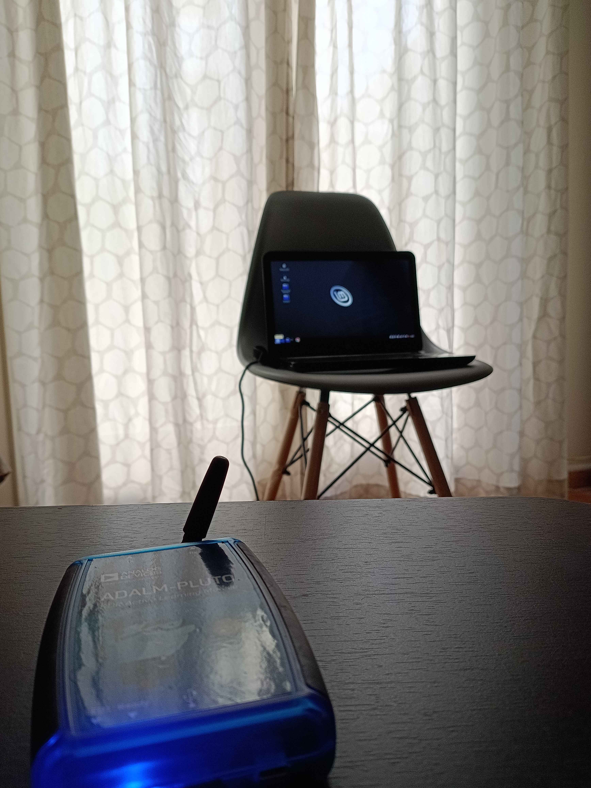
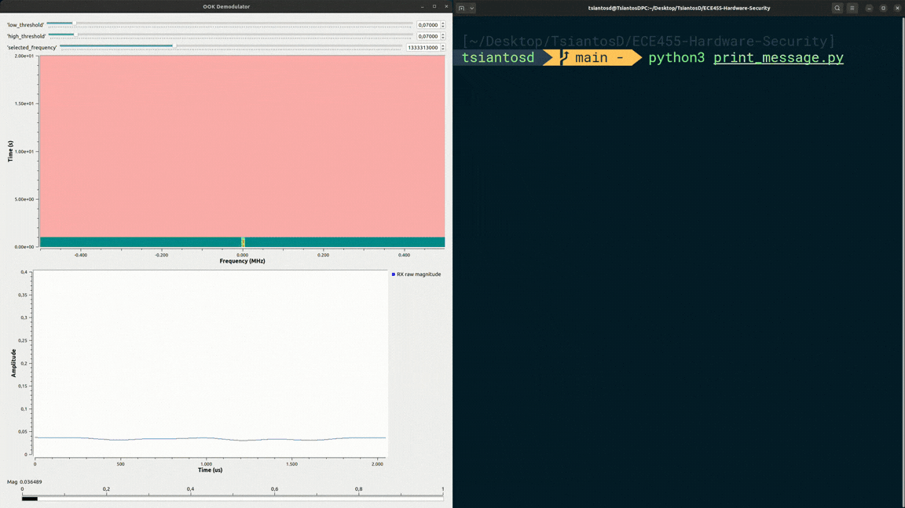

# ECE455 — Hardware Security


A covert radio-channel prototype that leaks data from an isolated computer by turning DDR RAM activity into a signal recoverable with SDR and GNU Radio.

## What this project does

This project demonstrates an end-to-end air-gap data exfiltration channel. A user-space C transmitter runs on the target machine and repeatedly stresses RAM in carefully timed bursts, encoding payload bits into DDR memory-bus activity. Those memory operations create electromagnetic leakage that a nearby receiver captures with an **ADALM-PLUTO SDR** and demodulates in **GNU Radio** using **On-Off Keying**.

The recovered bitstream is then aligned, decoded, and compared against the original payload, such as an AES key.



## Standout work

The standout implementation is a practical electromagnetic side-channel attack for leaking data from an air-gapped computer without network connectivity, kernel privileges, or hardware modification.

Key pieces of the project include:

- **RAM activity transmitter:** C programs stress memory in controlled bit intervals to encode data as radio-observable DDR bus activity.
- **Cache-bypassing memory traffic:** the transmitter uses non-temporal memory instructions so memory activity reaches the DDR bus instead of being hidden by CPU caches.
- **File-based payload transmission:** the transmitter can send a file such as an AES key at a selected bitrate.
- **SDR/GNU Radio receiver:** an ADALM-PLUTO SDR and GNU Radio flowgraphs receive and demodulate the emitted signal using On-Off Keying.
- **Bit recovery and validation tools:** Python scripts decode received output, align on the preamble, shift bitstreams, and compare recovered bits against the original payload.
- **Measured experiments:** logs record original/received bitstrings and bit-error counts across distance and bitrate combinations, including perfect-match runs.

The project went beyond the original hardware-security assignment by building a complete attack pipeline: target-side memory modulation, attacker-side SDR reception, and measured recovery of transmitted data.

## Results at a glance

The experiment logs cover receiver distances from 25 cm to 100 cm in this repository, and the project writeup reports successful data transfer up to **2 meters** at **128 bits per second**.

| Distance | Logged bitrates | Notes |
| --- | --- | --- |
| `25cm` | 2, 4, 8, 16, 32, 64, 128 bps | Multiple captured runs, including higher-bitrate tests. |
| `50cm` | 2, 4, 8, 16, 64, 128 bps | Mid-range measurements with bit-error logs. |
| `100cm` | 2, 4, 8, 16, 32, 64 bps | Longer-range logs, including perfect-match captures. |

Example successful metric log:

```text
✓ Perfect match — no bit errors detected
```



## Attack pipeline

```text
Air-gapped target
  src/transmitter/ramear.c
        |
        | non-temporal RAM writes encode bits
        v
DDR memory-bus electromagnetic leakage
        |
        | ADALM-PLUTO SDR + antenna
        v
Attacker receiver
  flowgraphs/receiver/03_FIR.grc
        |
        | On-Off Keying demodulation writes recovered bits
        v
Post-processing
  tools/print_message.py
  tools/compare_key.py
  tools/shift_bits.py
```

The default framing uses:

```text
Preamble: 10101001
EOM:      11111111
```

## Repository structure

| Path | Description |
| --- | --- |
| `src/transmitter/` | Target-side C transmitters and Makefile. |
| `flowgraphs/receiver/` | GNU Radio Companion receiver/demodulator designs. |
| `flowgraphs/capture.grc` | Additional capture flowgraph. |
| `tools/` | Python utilities for decoding, comparing, and shifting bitstreams. |
| `data/` | Example payloads such as the AES key and hello-world message. |
| `experiments/metrics/` | Captured bit-error logs grouped by distance and bitrate. |
| `docs/report.pdf` | Final project report. |
| `docs/presentation.pptx` | Final presentation slides. |
| `docs/assets/` | Setup and demo media used in this README. |

## Requirements

Target/transmitter side:

- Linux
- GCC
- Make
- x86 CPU with SSE2 support for `ramear.c`
- pthread support for `pagefaulter.c`

Attacker/receiver side:

- GNU Radio Companion
- ADALM-PLUTO or compatible SDR hardware
- Antenna suitable for the tested frequency range
- Python 3

## Build and run

Build the target-side transmitters:

```bash
cd src/transmitter
make
```

Transmit the sample AES key at 16 bps:

```bash
./ramear 16 ../../data/aes.key
```

Open the best receiver flowgraph on the attacker machine:

```bash
gnuradio-companion flowgraphs/receiver/03_FIR.grc
```

The receiver writes recovered output to:

```text
/tmp/output.bin
```

Decode a received message stream:

```bash
python3 tools/print_message.py /tmp/output.bin
```

Compare the received bitstream against the original AES key:

```bash
python3 tools/compare_key.py --received /tmp/output.bin --key data/aes.key
```

Shift a captured bitstream when alignment correction is needed:

```bash
python3 tools/shift_bits.py input.bin shifted.bin 1 --direction left
```

## Experiments

Experiment logs are grouped first by receiver distance and then by bitrate:

```text
experiments/metrics/25cm/16bps/
experiments/metrics/50cm/64bps/
experiments/metrics/100cm/32bps/
```

Each log includes:

- original bitstring,
- received bitstring,
- key length,
- received length,
- compared bit count,
- bit-error summary.

The implementation and analysis also considered timing jitter, cache hierarchy behavior, environmental noise sources, and bit-error-rate limits, which are key constraints for electromagnetic covert channels.

## Notes

This project should be run only on hardware you own or have permission to test. The transmitter and receiver are intended for controlled hardware-security experimentation and coursework demonstration.
